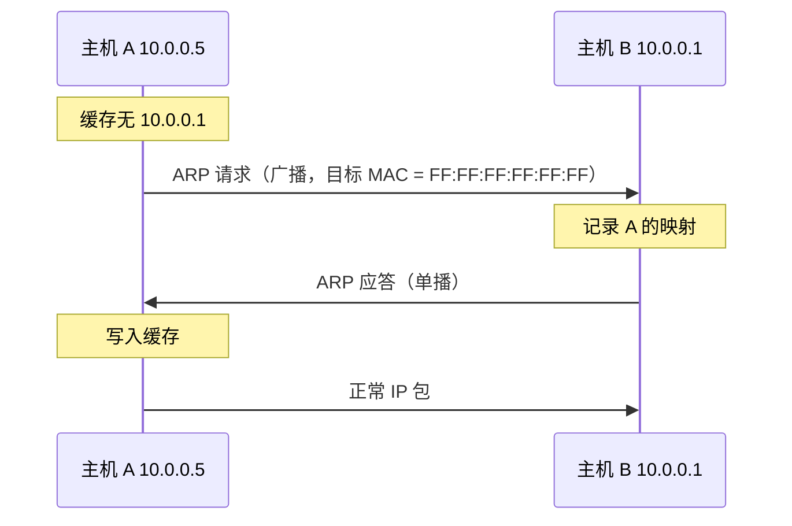

---
tags:
  - 基本功/以太网
  - 基本功/网络
---

# 以太网与 ARP

链路层要解决两个问题：**同一段链路上，帧发给谁**（`MAC` 地址），以及**网络层地址怎么映射成链路层地址**（`ARP`）。

`IP` 只负责「把包送到某个 IP 地址所在的网络」，真正在网线上传的时候靠的是 `MAC` 地址。ARP 就是这两套地址之间的桥。

## 1. 以太网帧格式

### 1.1 字段逐个

```
   ┌─────────┬─────┬──────────┬──────────┬────────┬───────────────┬────────┐
   │ 前导码 7 │ SFD │ 目的 MAC │ 源 MAC   │ 类型 2  │ 载荷 46~1500   │  FCS   │
   │         │  1  │    6     │    6     │EtherType│               │   4    │
   └─────────┴─────┴──────────┴──────────┴────────┴───────────────┴────────┘
    └─ 物理层开销，不算帧的一部分           └──── 帧头 14 ────┘  └─ 帧尾 ─┘
       抓包看不到，只在算线路利用率时计入

   三个尺寸都是从这张图加出来的
     帧头        14 字节 = 6 + 6 + 2
     最小帧长    64 字节 = 14 + 46 + 4（不含前导码与 SFD）
     最大帧长  1518 字节 = 14 + 1500 + 4

   一条排查时的关键约束：padding 不计入 IP 首部的 Total Length
     载荷下限 46 是 CSMA/CD 的遗留要求（保证 10 Mbps 共享总线上
     能在发完之前检测到冲突），不足要补零到 46
     └─ RFC 894：这个 padding 不属于 IP 包，也不计入 IP 首部的 Total Length
        所以会出现「帧载荷 46 字节、但 IP 总长只有 40」这种组合 ——
        多出来的 6 字节是补零，接收方按 Total Length 截断，padding 被丢弃
```

| 字段 | 长度 | 作用 |
| --- | --- | --- |
| 前导码（Preamble） | 7 字节 | 物理层同步，交替的 `10101010` |
| SFD | 1 字节 | 帧起始定界符，`10101011` |
| 目的 MAC | 6 字节 | 接收方链路层地址 |
| 源 MAC | 6 字节 | 发送方链路层地址 |
| 类型 / 长度 | 2 字节 | `EtherType` 或 `Length`，见 §2 |
| 载荷 | 46 ~ 1500 字节 | 上层协议数据 |
| FCS | 4 字节 | CRC-32 校验，帧尾 |

**前导码与 SFD 是物理层开销，不算帧的一部分**——抓包工具看不到它们，8 字节只在计算线路利用率时才需要算进去。

### 1.2 三个尺寸

| 项 | 值 | 推导 |
| --- | --- | --- |
| 帧头 | **14 字节** | 6 + 6 + 2 |
| 最小帧长 | **64 字节** | 14 + 46 + 4（不含前导码与 SFD） |
| 最大帧长 | **1518 字节** | 14 + 1500 + 4 |
| 帧间隙 IFG | 12 字节 | 两帧之间必须留的空闲，等价于 96 bit 时间 |

**最小帧 64 字节**是 CSMA/CD 的遗留要求——它保证在 10 Mbps 共享总线上，发送方能在发完之前检测到冲突。千兆以上的全双工链路已无冲突，但这个下限被保留了下来。

由此得到**载荷下限 46 字节**。RFC 894 对补零的规定：

> The minimum length of the data field of a packet sent over an Ethernet is **46 octets**. If necessary, the data field should be padded (with octets of zero) to meet the Ethernet minimum frame size. **This padding is not part of the IP packet and is not included in the total length field of the IP header.**

最后一句是排查时的关键：**padding 不计入 IP 首部的 `Total Length`**。所以会看到「帧载荷 46 字节，但 IP 总长只有 40」这种组合——多出来的 6 字节是补零，接收方按 `Total Length` 截断，padding 被丢弃。

> RFC 894 里有一处笔误：第二段写作 `The minimum length of the data field ... is 1500 octets`，但同句后半 `thus the maximum length of an IP datagram sent over an Ethernet is 1500 octets` 表明此处应为 **maximum**。按上下文理解，不要读成「载荷下限 1500」。

### 1.3 载荷上限与 MTU

**1500 字节的载荷上限，就是常说的 MTU**（Maximum Transmission Unit）。

这个数被层层传导下去：

```
以太网载荷上限 1500
  → IP 数据报上限 1500（RFC 894）
      → TCP MSS = 1500 − 20(IP) − 20(TCP) = 1460
```

MTU 的完整讨论（含路径 MTU 发现与黑洞）见 [[05-TCP 协议]] §3.6。

### 1.4 VLAN 标签

802.1Q 在源 MAC 之后插入 **4 字节**：

```
   不带标签
   ┌──────────┬──────────┬───────────┬───────────────┐
   │ 目的 MAC │  源 MAC  │  类型 2    │  载荷 46~1500  │
   └──────────┴──────────┴───────────┴───────────────┘

   带一个 802.1Q 标签（在源 MAC 之后插入 4 字节）
   ┌──────────┬──────────┬────────────┬─────────┬────────────┬───────────────┐
   │ 目的 MAC │  源 MAC  │ TPID       │   TCI   │ 真正的      │  载荷 46~1500  │
   │          │          │ 0x8100 (2) │   (2)   │ EtherType  │               │
   └──────────┴──────────┴────────────┴─────────┴────────────┴───────────────┘
                          └───────── 4 字节 ─────────┘

   TCI 内部还要再拆成三段
     PCP   3 位   优先级 0–7，供 QoS 用
     DEI   1 位   拥塞时可优先丢弃
     VID  12 位   VLAN ID，0–4095（0 与 4095 保留）

   两个容易记错的后果
     带标签后帧头变成 18 字节、帧长变成 1518–1522，
     但 MTU 仍是 1500 —— 标签占的是帧头空间，不占载荷
     QinQ 在外层再加 4 字节：外层 TPID 是 0x88A8（S-Tag，运营商侧），
     内层仍是 0x8100（C-Tag，用户侧），帧头共 22 字节
     └─ 它让运营商的 VLAN 空间与用户的互不干扰
```

| 字段 | 长度 | 含义 |
| --- | --- | --- |
| TPID | 2 字节 | Tag Protocol Identifier，值 `0x8100` 表示后面是 VLAN 标签 |
| TCI | 2 字节 | Tag Control Information，拆为 `PCP`(3) + `DEI`(1) + `VID`(12) |

| TCI 子字段 | 位宽 | 含义 |
| --- | --- | --- |
| `PCP` | 3 | Priority Code Point，0~7 的优先级，QoS 用 |
| `DEI` | 1 | Drop Eligible Indicator，拥塞时可优先丢弃 |
| `VID` | 12 | VLAN ID，0~4095（0 与 4095 保留） |

**带标签后帧头变 18 字节，帧长变 1518~1522，但 MTU 仍是 1500**——标签占的是帧头空间，不占载荷。

**QinQ（双层标签）** 用在外层再加 4 字节：外层的 TPID 是 `0x88A8`（S-Tag，运营商侧），内层仍是 `0x8100`（C-Tag，用户侧），帧头共 22 字节。它让运营商的 VLAN 空间与用户的互不干扰。

## 2. EtherType：类型字段到底区分什么

2 字节的类型字段**标识载荷里装的是哪个上层协议**。它指向的是网络层，与「MAC 层协议」无关。

| `EtherType` | 协议 |
| --- | --- |
| `0x0800` | IPv4 |
| `0x0806` | ARP |
| `0x8035` | RARP |
| `0x86DD` | IPv6 |
| `0x8100` | VLAN 标签（802.1Q C-Tag） |
| `0x8847` / `0x8848` | MPLS 单播 / 上游分配标签 |
| `0x8863` / `0x8864` | PPPoE 发现阶段 / 会话阶段 |
| `0x888E` | 802.1X 端口认证 |
| `0x88A8` | 服务 VLAN 标签（S-Tag） |
| `0x88CC` | LLDP 链路发现 |

完整注册表在 IANA 的 *IEEE 802 Numbers*，但它本身声明「列表来自各种来源、未经核实」，**权威值以 IEEE Registration Authority 为准**。

### 2.1 同一字段的两种语义：`0x0600` 分界线

这个位置在两种以太网标准里含义不同：

| 字段值 | 语义 | 标准 |
| --- | --- | --- |
| `0x0000` ~ `0x05DC`（0 ~ 1500） | **Length**：载荷的字节数 | IEEE 802.3 |
| `0x05DD` ~ `0x05FF`（1501 ~ 1535） | **未使用**，真空区 | —— |
| `0x0600` ~ `0xFFFF`（1536 ~ 65535） | **EtherType**：上层协议类型 | Ethernet II / DIX |

**中间特意留出 35 个值的空隙**，让接收端能无歧义地判断这个字段该按哪种语义读：

```c
if (type <= 1500)   /* 802.3：后面跟 LLC/SNAP 头 */
else                /* Ethernet II：type 就是 EtherType */
```

`0x0800`（2048）远大于 1536，所以它是 EtherType 而非 Length。

**802.3 帧走 `LLC/SNAP`**：`Length` 之后跟 `LLC` 头（`DSAP` 1 + `SSAP` 1 + `Control` 1~2 字节），再跟 `SNAP` 头（`OUI` 3 + `EtherType` 2 字节）——**最终还是要靠 EtherType 定位上层协议，只是往后多绕了几个字节**。今天几乎见不到原生 802.3 帧，两种语义并存属于历史遗留。

### 2.2 嵌套：VLAN 标签之后的才是真 EtherType

```c
/* 抓包里看到的顺序 */
目的 MAC | 源 MAC | 0x8100 | TCI | 真正的 EtherType | ...
                      ↑                   ↑
                 "后面是 VLAN 标签"    真正标识上层协议
```

写解析代码时容易踩的坑：**看到 `0x8100` 不能直接判定上层是 IPv4**，必须再往后读 4 字节才是真正的 EtherType。QinQ 场景要连续剥两层。

## 3. MAC 地址

### 3.1 结构

48 位，通常写成 `00:1A:2B:3C:4D:5E` 六组十六进制。分成两半：

| 部分 | 长度 | 含义 |
| --- | --- | --- |
| OUI | 高 24 位 | 厂商标识，由 IEEE 分配 |
| NIC Specific | 低 24 位 | 厂商自行编号 |

**第一个字节的两个 bit 有特殊含义**：

| bit | 名称 | 含义 |
| --- | --- | --- |
| bit 0（最低位） | `I/G` | 0 = 单播，1 = 组播 |
| bit 1 | `U/L` | 0 = 全球唯一（厂商烧录），1 = 本地管理（软件设置） |

所以 `01:00:5E:...` 是组播地址（首字节最低位为 1），`FF:FF:FF:FF:FF:FF` 是广播地址，而 `02:...` 开头的通常是虚拟机/容器软件生成的本地管理地址。

### 3.2 特殊地址

| 地址 | 用途 |
| --- | --- |
| `FF:FF:FF:FF:FF:FF` | 广播，本链路所有设备都收 |
| `01:00:5E:xx:xx:xx` | IPv4 组播映射（低 23 位取自 IP 组播地址） |
| `33:33:xx:xx:xx:xx` | IPv6 组播映射 |
| `01:80:C2:00:00:00` ~ `01:80:C2:00:00:0F` | 生成树、LLDP 等链路协议专用，**交换机不转发** |

### 3.3 与 IP 地址的关系

| 维度 | MAC | IP |
| --- | --- | --- |
| 层次 | 链路层 | 网络层 |
| 长度 | 48 位 | 32 位（IPv4）/ 128 位（IPv6） |
| 范围 | **单段链路内有效** | 全网可路由 |
| 分配 | 出厂烧录（或软件设置） | 动态（DHCP）或静态 |
| 变化 | 跨路由不变（源/目的会随每跳改写） | 端到端不变 |

**一句话区分**：IP 地址回答「最终送到哪台机器」，MAC 地址回答「**这一跳**发给哪个网卡」。跨路由器时，IP 首部的源/目的地址不变，但帧头里的 MAC 每跳都换。

## 4. ARP

### 4.1 解决什么问题

发一个 IP 包，内核知道目的 IP，也知道**下一跳的 IP**（查路由表得到），但网卡需要的是**下一跳的 MAC**。ARP 就是做这个映射的。

```
目的 IP 10.1.2.3
  → 查路由表 → 下一跳 IP 10.0.0.1
      → 需要 10.0.0.1 的 MAC
          → ARP 查缓存 → 没有就广播询问
```

### 4.2 报文格式

ARP 报文直接封装在以太网帧里，`EtherType = 0x0806`。**没有 IP 首部**——ARP 是链路层协议，不上 IP。

| 字段 | 长度 | 常见值 |
| --- | --- | --- |
| 硬件类型 | 2 | 1 = 以太网 |
| 协议类型 | 2 | `0x0800` = IPv4 |
| 硬件地址长度 | 1 | 6 |
| 协议地址长度 | 1 | 4 |
| 操作码 | 2 | 1 = 请求，2 = 应答 |
| 发送方 MAC | 6 | —— |
| 发送方 IP | 4 | —— |
| 目标 MAC | 6 | 请求时填 0 |
| 目标 IP | 4 | —— |

### 4.3 交互流程



**三个要点**：

1. **请求是广播、应答是单播**——请求时不知道对方 MAC，只能广播；应答时已经知道对方 MAC（从请求里得到），直接单播。
2. **请求里携带发送方的映射**，接收方顺手把 `A → MAC` 记进自己的缓存。双向通信只需一次 ARP 交互。
3. **只查下一跳，不查最终目的**。跨网段时 ARP 解析的是网关的 MAC，不是目标主机的 MAC。

### 4.4 ARP 缓存

```bash
ip neigh show
# 10.0.0.1 dev eth0 lladdr 00:1a:2b:3c:4d:5e REACHABLE
```

状态机的几个主要状态：

| 状态 | 含义 |
| --- | --- |
| `REACHABLE` | 最近确认过，可放心用 |
| `STALE` | 条目还在但过期了，**仍会先用**，同时触发确认 |
| `DELAY` | 已发数据、等确认窗口，还没开始探测 |
| `PROBE` | 正在发 ARP 请求探测 |
| `FAILED` | 探测无响应，不再使用 |

**`STALE` 的含义是「可用但需复核」**，不是「不可用」——Linux 会先用它发包，同时发 ARP 确认；确认失败才转入 `PROBE`。所以看到大量 `STALE` 是正常的，看到 `FAILED` 才是问题。

**缓存项会过期**（`gc_stale_time`，默认 60 秒），过期后进入复核流程，不是直接删除。

### 4.5 免费 ARP

**免费 ARP（Gratuitous ARP）**是指发送方查询**自己**的 IP 地址：

- **用途一：检测地址冲突。** 主机启动时发一次，若收到应答说明有人在用同一个 IP。
- **用途二：更新别人的缓存。** 故障切换（如 keepalived 漂移 VIP）后，新主机广播免费 ARP，让全网把 VIP 的 MAC 更新成自己的——否则流量还会发到旧主机的 MAC 上。**这是 VIP 漂移必须发的，不发就会断流。**
- **用途三：交换机 MAC 表刷新。** 广播帧让沿途交换机把 VIP 对应的 MAC 表项改写。

### 4.6 ARP 的安全问题

ARP **没有任何认证**——谁声称自己是某个 IP，接收方就信。

| 攻击 | 手法 | 后果 |
| --- | --- | --- |
| ARP 欺骗 | 伪造 ARP 应答，声称网关 IP 对应自己的 MAC | 流量被中间人截获/篡改 |
| ARP 泛洪 | 大量伪造映射填满交换机的 MAC 表 | 交换机退化成集线器，全端口泛洪 |

**防御**：交换机上开 `DAI`（Dynamic ARP Inspection，校验 ARP 与 DHCP Snooping 记录是否一致）、静态 ARP 绑定、端口安全（限制每端口可学习的 MAC 数）。这些都在交换机侧做，**主机侧无法防**。

### 4.7 RARP：反过来的查询

`RARP`（Reverse ARP，RFC 903）解决的问题与 ARP 相反：**已知自己的 MAC，求自己的 IP**。用途是无盘工作站启动——它没有硬盘，没地方存 IP 配置，只能靠 MAC 向服务器问。

**报文格式与 ARP 完全相同**，只有操作码不同：

| | ARP | RARP |
| --- | --- | --- |
| 操作码 | 1 请求 / 2 应答 | 3 请求 / 4 应答 |
| `EtherType` | `0x0806` | `0x8035` |
| 谁回答 | 目标主机自己 | 专门的 RARP 服务器 |
| 缓存 | 有（邻居表） | **无**——服务器维护的是静态配置表 |

**被淘汰的三条原因**：

| RARP 的限制 | DHCP 的解法 |
| --- | --- |
| 只能给 IP，**给不了掩码 / 网关 / DNS** | 选项机制下发全套参数 |
| 服务器必须**手工维护 MAC → IP 静态表** | 地址池动态分配，无需手工登记 |
| **不能跨网段**（请求是广播，路由器不转发） | 中继代理（`giaddr`）跨网段转发 |

今天只在极老的设备与教学材料里见到 RARP。区分「查 IP 的缓存」与「查 MAC 的缓存」时注意一点：**RARP 侧没有缓存概念**，那是服务器上的一张静态表。

## 5. 交换机与 MAC 表

### 5.1 自学习与泛洪

交换机工作在链路层，靠**自学习**建立转发依据：

1. 收到帧时，把**源 MAC 与入端口**的关系记进 MAC 表；
2. 查**目的 MAC**：
   - 表里有 → 只从对应端口转发（单播转发）；
   - 表里没有 → **从所有其他端口泛洪**；
   - 是广播/组播 → 泛洪。

**MAC 表项有老化时间**（通常 300 秒），老的条目会被删除，所以设备换端口后网络能自愈。

**泛洪的代价**是排查时最常见的现象：大量未知单播导致链路带宽被占满。成因通常是 MAC 表被打满（ARP 泛洪攻击）或 MAC 表容量不足（接入设备过多）。

交换机靠「边转发边学」把 MAC 表建起来。

```
   收到一帧
     │
     ├─ ① 学源地址
     │     把「源 MAC + 入端口」写进 MAC 表
     │     └─ 不管这帧最终往哪发，先记下「这个地址在我这个口上」
     │
     └─ ② 查目的地址
           ├─ 表里有        ──▶ 只从对应端口转发（单播转发）
           ├─ 表里没有      ──▶ 从所有其他端口泛洪
           └─ 是广播/组播   ──▶ 泛洪

   表项有老化时间（通常 300 秒）
     老条目被删除，于是设备换端口后网络能自愈 ——
     否则一条过期的表项会把流量永远引向旧端口

   泛洪的代价是排查时最常见的现象
     大量未知单播占满链路带宽
     └─ 成因通常是 MAC 表被打满（ARP 泛洪攻击）
        或 MAC 表容量不足（接入设备过多）
```

### 5.2 三张表的分工

「MAC 表」与「IP 路由表」经常被当成同一件事，实际网络里同时存在**三张不同的转发表**：

| | 交换机 MAC 表 | 主机 ARP 缓存 | 主机路由表 FIB |
| --- | --- | --- | --- |
| 所在设备 | 交换机（二层） | 每台主机自己 | 每台主机、路由器 |
| 键 → 值 | `MAC` → 端口 | `IP` → `MAC` | `前缀` → 下一跳 |
| 匹配方式 | **精确匹配**（48 位全等） | 精确匹配 | **最长前缀匹配** |
| 怎么建立 | **自动学习**（看帧的源 MAC） | ARP 解析 | 内核自动 + 静态 + 路由协议 + DHCP |
| 查不到怎么办 | **泛洪** | **发 ARP 请求** | **丢包 + 回 ICMP** |
| 老化 | 有，通常 300 秒 | 有，`gc_stale_time` 默认 60 秒 | 路由撤销时才变 |
| 作用范围 | 单段链路 | 单段链路 | 全网 |

**三条容易混的**：

1. **交换机的 MAC 表与主机的 ARP 缓存不是同一张表**。前者是 `MAC → 端口`（决定从哪个口转发），后者是 `IP → MAC`（决定帧头填什么）。键和值都不同。
2. **「查不到就泛洪」是二层独有的兜底**，三层没有对应机制——路由表查不到就是丢包。这个差异决定了两类环路的不同表现：二层环路引发广播风暴，三层环路只让包被 `TTL` 耗尽。
3. **主机上不需要 MAC 表**。主机的出接口由路由决定，只有交换机才需要维护「MAC 与端口」的映射。

排查时按这个顺序走：**路由表（发给谁）→ 邻居表（帧头填什么）→ 交换机 MAC 表（从哪个口出）**。三层各自的「查不到」对应三种完全不同的现象：`Network is unreachable`、`No route to host`、链路层泛洪。

## 6. 常见故障与排查

### 6.1 症状到方向

| 症状 | 先看什么 | 常见成因 |
| --- | --- | --- |
| 同一网段内 ping 不通 | `ip neigh show` 是否 `FAILED` | ARP 解析失败：VLAN 不通、IP 冲突、对端静默丢弃 ARP |
| 换了网关后短暂断流 | 是否发了免费 ARP | 旧 MAC 还在别人缓存里 |
| 跨网段不通、同网段通 | `ip route get` | 网关的 ARP 解析失败 |
| 间歇性丢包 | `arping` 检测是否有两个主机应答 | IP 地址冲突 |
| 虚拟机迁移后网络中断 | 交换机 MAC 表是否已刷新 | 免费 ARP 未发或未被转发 |
| 抓包看不到 ARP 但有 IP 包 | 本机 ARP 缓存 | 缓存命中，无需 ARP |

### 6.2 三个命令

```bash
ip neigh show                          # ARP 缓存与状态
arping -I eth0 10.0.0.1                # 主动发 ARP 探测（比 ping 更底层，能区分「ARP 不通」与「IP 不通」）
tcpdump -i eth0 -nn arp                # 抓 ARP 交互
```

**`arping` 的价值**：`ping` 要经过 ARP + IP + ICMP 三层，不通时分不清哪层出问题；`arping` 只走 ARP，能直接定位是不是链路层解析的问题。

### 6.3 参数

| 参数 | 默认 | 改它的后果 |
| --- | --- | --- |
| `net.ipv4.neigh.default.gc_stale_time` | 60 | 缓存项多久转入复核 |
| `net.ipv4.neigh.default.gc_thresh1/2/3` | 视内存 | 缓存的三个水位线；`gc_thresh3` 是硬上限，达到后新条目直接丢弃 |
| `net.ipv4.conf.*.arp_ignore` | 0 | 置 1 只在目标 IP 是入接口地址时应答——**VIP 漂移场景必须配** |
| `net.ipv4.conf.*.arp_announce` | 0 | 控制 ARP 请求用哪个源地址，多网卡同网段时防串扰 |

`gc_thresh3` 打满是容器密集环境的典型故障——节点上跑几百个容器时，ARP 缓存条目数会暴涨，达到上限后新解析全部失败，表现为「部分容器网络时通时不通」。排查时看：

```bash
ip neigh show | wc -l
sysctl net.ipv4.neigh.default.gc_thresh3
```

## 相关

- [[08-IP 协议与路由]] —— IP 层：地址、路由匹配与转发；ARP 是它「交给链路层」那一步的实现
- [[05-TCP 协议]] —— MTU 与 MSS 的完整推导，以太网的 1500 是这条链的起点
- [[01-容器的本质]] —— `veth` 对是虚拟的以太网链路，容器网络建立在网桥与 ARP 之上
- [[01-cpu时间分片]] —— 收包软中断的 CPU 分配

## 参考

- D. Plummer. *An Ethernet Address Resolution Protocol*. RFC 826, November 1982. https://www.rfc-editor.org/rfc/rfc826
- C. Hornig. *A Standard for the Transmission of IP Datagrams over Ethernet Networks*. RFC 894, April 1984. https://www.rfc-editor.org/rfc/rfc894
- J. Postel, J. Reynolds. *A Standard for the Transmission of IP Datagrams over IEEE 802 Networks*. RFC 1042, February 1988. https://www.rfc-editor.org/rfc/rfc1042
- L. Mamakos, K. Lidl, J. Evarts, D. Carrel, D. Simone, R. Wheeler. *A Method for Transmitting PPP Over Ethernet (PPPoE)*. RFC 2516, February 1999. https://www.rfc-editor.org/rfc/rfc2516
- *IEEE 802 Numbers (Ethertype registry)*. IANA. https://www.iana.org/assignments/ieee-802-numbers/ieee-802-numbers.xhtml
- *IEEE 802.1Q — Bridges and Bridged Networks*. IEEE. https://standards.ieee.org/ieee/802.1Q/6844/

IEEE 802.3 与 802.1Q 是付费标准，本篇的帧长、VLAN 标签结构等描述对照公开的 RFC 与 IANA 注册表；交换机行为与内核参数来自 Linux 文档与 `iproute2`，未逐条对应到单一规范。
