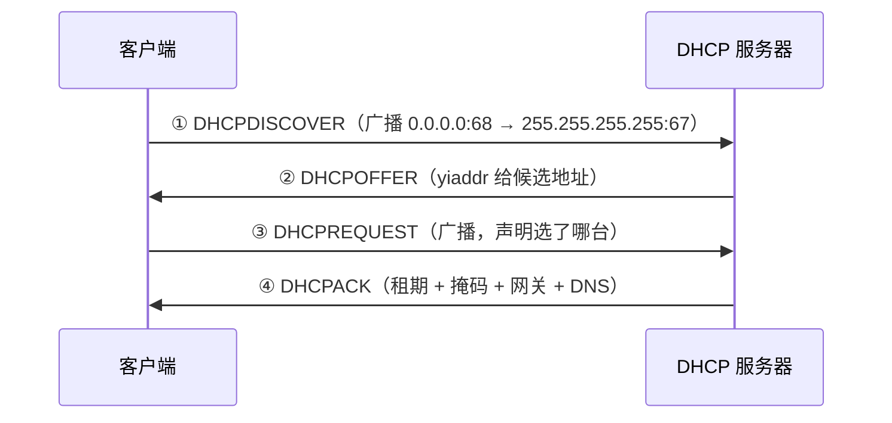

---
tags:
  - 基本功/网络
---

# 主机接入网络：DHCP 与地址配置

一台机器从「网线插上」到「能 ping 通外网」，中间要跨四层完成配置：链路层起接口、网络层拿地址、装路由、解析邻居。这篇把这条链路走完。

`DHCP`（Dynamic Host Configuration Protocol，RFC 2131）负责其中最关键的一步——**除了 MAC 地址，其他参数全部由它下发**。

## 1. 接入前的状态

### 1.1 只有 MAC 地址

新机器上电后，网卡本身是「可用的」——`MAC` 地址出厂就烧在网卡里，不需要任何协商：

```bash
$ ip link set eth0 up
$ ip addr show eth0
2: eth0: <BROADCAST,MULTICAST,UP,LOWER_UP> mtu 1500 state UP
    link/ether 52:54:00:12:34:56 brd ff:ff:ff:ff:ff:ff
```

`UP` 是管理状态（人为置起），`LOWER_UP` 是物理状态（检测到载波）。两个都在，说明链路层通了。

此时**没有 `inet` 行**——IP 地址还没有。

### 1.2 三个可选项

| 方式 | 适用场景 | 代价 |
| --- | --- | --- |
| **静态配置** | 服务器、网络设备、固定地址的主机 | 每台都得手工改，改网段要全改 |
| **DHCP** | 绝大多数终端 | 依赖服务器，服务器挂了新机器上不了网 |
| **链路本地地址** | DHCP 失败时的兜底 | 只能同网段互通 |

**链路本地地址**（`169.254.0.0/16`，IPv4 的 APIPA）是自动生成的：主机随机挑一个该段地址，用 ARP 探测确认没冲突就用。它的**局限是没有任何网关**，所以只能与同一链路上的其他主机通信。

看到 `169.254.x.x` 就意味着**DHCP 失败了**——这是排查时的重要信号。

## 2. DHCP 的四步交换

### 2.1 报文格式

DHCP 报文脱胎于 `BOOTP`，字段固定部分 236 字节 + 可变选项：

| 字段 | 长度 | 含义 |
| --- | --- | --- |
| `op` | 1 | 1 = 请求（BOOTREQUEST），2 = 应答（BOOTREPLY） |
| `htype` | 1 | 硬件类型，1 = 以太网 |
| `hlen` | 1 | 硬件地址长度，以太网为 6 |
| `hops` | 1 | 客户端置 0，中继代理使用 |
| `xid` | 4 | **事务 ID**，客户端选的随机数，用来配对请求与应答 |
| `secs` | 2 | 从开始获取地址起过去的秒数 |
| `flags` | 2 | 最高位是 `BROADCAST` 标志 |
| `ciaddr` | 4 | 客户端**已有**的 IP，仅在 BOUND / RENEWING / REBINDING 时填 |
| `yiaddr` | 4 | **Your IP**——服务器分配给客户端的地址 |
| `siaddr` | 4 | 下一个要用的服务器地址 |
| `giaddr` | 4 | **中继代理**地址，跨网段时用 |
| `chaddr` | 16 | 客户端硬件地址（MAC） |
| `sname` | 64 | 可选的服务器名 |
| `file` | 128 | 引导文件名 |
| `options` | 可变 | 参数区，前 4 字节是 magic cookie `99.130.83.99` |

**`options` 里必带一项 `DHCP message type`**（RFC 2131 的硬要求），因为 `op` 只区分「请求/应答」这种粗粒度，具体是 DISCOVER 还是 REQUEST 靠这个选项。

**传输层**：客户端发往服务器端口 **67**，服务器回客户端端口 **68**。

报文脱胎于 BOOTP：固定部分 236 字节，后面跟可变选项。

```
   ┌────┬───────┬──────┬──────┬───────────┬──────────┬────────────┐
   │ op │ htype │ hlen │ hops │    xid    │   secs   │   flags    │
   │ 1  │   1   │  1   │  1   │     4     │    2     │     2      │
   └────┴───────┴──────┴──────┴───────────┴──────────┴────────────┘
   ┌──────────┬──────────┬──────────┬──────────┐
   │ ciaddr 4 │ yiaddr 4 │ siaddr 4 │ giaddr 4 │
   └──────────┴──────────┴──────────┴──────────┘
   ┌───────────────────┬───────────────┬───────────────┐
   │     chaddr 16     │   sname 64    │    file 128   │
   └───────────────────┴───────────────┴───────────────┘
   ┌──────────────────────────────────────────────────────────┐
   │ options（可变）                                           │
   │   前 4 字节是 magic cookie 99.130.83.99                    │
   │   必带一项 DHCP message type                               │
   └──────────────────────────────────────────────────────────┘

   四个地址字段各管一段
     ciaddr   客户端「已有」的 IP —— 只在 BOUND / RENEWING / REBINDING 时填
     yiaddr   「Your IP」—— 服务器分配给客户端的地址
     siaddr   下一个要用的服务器地址
     giaddr   中继代理地址，跨网段时用

   两处必须一起记的约定
     op 只区分「请求 / 应答」这种粗粒度；具体是 DISCOVER 还是 REQUEST，
       靠 options 里的 DHCP message type —— 这是 RFC 2131 的硬要求
     端口方向是反的：客户端发往服务器 67，服务器回客户端 68
```

### 2.2 DORA 四步



**为什么 ①③ 都是广播**：

| 报文 | 源地址 | 理由 |
| --- | --- | --- |
| `DISCOVER` | `0.0.0.0` | 客户端还没有 IP，不知道服务器在哪 |
| `REQUEST` | `0.0.0.0` | 同上；且**要让所有发过 OFFER 的服务器都听到「我选了别人」**，好回收它们预留的地址 |

`REQUEST` 里必须带 `server identifier` 选项（指明选了哪台）和 `requested IP address`（填所选 OFFER 的 `yiaddr`）。

**`flags` 里的 `BROADCAST` 位**：某些客户端在被配置 IP 之前无法接收单播，会形成死锁（没有地址就收不到地址）。这类客户端把这个位置 1，请求服务器广播回复。RFC 2131 对此的表述：

> some clients require broadcast because they cannot accept unicast IP datagrams before being configured

### 2.3 地址冲突探测

收到 `ACK` 后客户端**必须**做最后检查（RFC 2131）：

```bash
$ arping -D -I eth0 -c 2 10.0.0.5      # -D = duplicate address detection
```

- 有应答 → 地址已被占用 → 发 `DHCPDECLINE`，重新走 DORA
- 无应答 → 地址可用，正式启用

服务器侧在分配前 `SHOULD` 也检查一次（例如用 ICMP Echo 探测），但**客户端侧的检查不能省**——服务器可能刚把同一个地址发给了别人。

### 2.4 配置落地

```bash
$ ip addr show eth0
    inet 10.0.0.5/24 brd 10.0.0.255 scope global dynamic eth0
         valid_lft 86395sec preferred_lft 86395sec

$ ip route show
default via 10.0.0.1 dev eth0 proto dhcp src 10.0.0.5 metric 100
10.0.0.0/24 dev eth0 proto kernel scope link src 10.0.0.5
```

两条路由来自两个不同的地方：

| 路由 | 来源 | 依据 |
| --- | --- | --- |
| `10.0.0.0/24 ... proto kernel` | **内核自动** | 配地址时按掩码算出的直连网段 |
| `default via 10.0.0.1 ... proto dhcp` | **DHCP 客户端** | 服务器下发的路由器选项 |

**`proto` 字段是排查的钥匙**：`kernel` = 内核自动生成、`dhcp` = 租约下发、`static` = 手工配的、`ra` = IPv6 路由通告。看到一条路由不符合预期时，先看 `proto` 就知道该去哪改。

**`scope global dynamic`** 里的 `dynamic` 表示这是租约地址，会到期。

## 3. 客户端状态机与租约

### 3.1 六个主要状态

| 状态 | 在做什么 |
| --- | --- |
| `INIT` | 起始状态，准备发 DISCOVER |
| `SELECTING` | 收集 OFFER，选一台发 REQUEST |
| `REQUESTING` | 等 ACK |
| `BOUND` | 已配置完成，正常使用 |
| `RENEWING` | T1 到期，**单播**找原服务器续租 |
| `REBINDING` | T2 到期，**广播**找任意服务器 |

另外还有 `INIT-REBOOT`：客户端重启后记得上次的地址，直接发 REQUEST 验证还能不能用（`requested IP address` 填已知地址，**不带** `server identifier`）。

六个状态加一个重启状态，差别集中在「谁在找谁、用单播还是广播」。

```
   INIT
     │ 发 DISCOVER（广播）
     ▼
   SELECTING
     │ 收集 OFFER，选一台发 REQUEST
     ▼
   REQUESTING
     │ 收到 ACK
     ▼
   BOUND ──────────── 已配置完成，正常使用
     │
     ├─ T1 到期（单播，找原服务器）──▶ RENEWING
     └─ T2 到期（广播，找任意服务器）─▶ REBINDING
                                          │
                                    租期到期 ──▶ 立即停止使用该地址

   另有一个 INIT-REBOOT
     客户端重启后记得上次的地址，直接发 REQUEST 验证还能不能用
     └─ requested IP address 填已知地址，且不带 server identifier

   字段约束的规律只有两条
     只有 SELECTING 需要指明服务器（因为还没确定用谁）
       └─ server-ip 是 MUST
     只有 RENEWING / REBINDING 填 ciaddr（因为已经有地址了）
       └─ server-ip 是 MUST NOT
```

### 3.2 各状态下报文能带什么

RFC 2131 的 Table 4 把不同状态下的字段约束列得很细：

| | `INIT-REBOOT` | `SELECTING` | `RENEWING` | `REBINDING` |
| --- | --- | --- | --- | --- |
| 广播 / 单播 | broadcast | broadcast | **unicast** | broadcast |
| `server-ip` | MUST NOT | MUST | MUST NOT | MUST NOT |
| `requested-ip` | MUST | MUST | MUST NOT | MUST NOT |
| `ciaddr` | zero | zero | IP | IP |

**规律的读法**：只有 `SELECTING` 需要指明服务器（因为还没确定用谁），只有 `RENEWING`/`REBINDING` 填 `ciaddr`（因为已经有地址了）。

### 3.3 T1 与 T2

| 定时器 | 默认比例 | 到期的动作 |
| --- | --- | --- |
| `T1` | 租期的 50% | 向**原服务器单播** REQUEST（单播不经过中继） |
| `T2` | 租期的 87.5% | **广播** REQUEST，任何服务器都可以应答 |
| 租期到期 | 100% | **立即停止使用该地址** |

RFC 2131 正文只定义了这两个定时器，**没有规定默认比例**；50% 与 87.5% 出自 DHCP 选项 58（Renewal Time Value）与 59（Rebinding Time Value）的定义。服务器可以通过这两个选项改。

**租约到期后的行为**（RFC 2131）：如果客户端联系不上任何服务器且租约已到期，**必须立即停止使用该地址**。这解释了一类典型故障——「机器用着用着突然断网」：T1 单播续租失败（服务器挂了）、T2 广播也失败、租约一到期地址作废。

两个定时器把租期切成三段，越往后越「没人管」。

```
   0%                             50%                 87.5%       100%
   ├───────────────────────────────┼────────────────────┼──────────┤
   BOUND                           T1                   T2       租期到期
   │                                │                    │          │
   │                        单播 REQUEST          广播 REQUEST   立即停止
   │                        找原服务器            找任意服务器   使用该地址
   │                                │                    │          │
   └── 谁应答 ──────────────────────┼────────────────────┼──────────┘
                              只有原服务器        任何服务器都可以
                              （单播不过中继）     （广播能过中继）

   比例不是协议正文定的
     RFC 2131 正文只定义了这两个定时器，没有规定默认比例；
     50% 与 87.5% 出自 DHCP 选项 58（Renewal Time Value）
     与 59（Rebinding Time Value）的定义，服务器可以通过这两个选项改

   一串失败串起来就是一类典型故障
     T1 单播续租失败（服务器挂了）──▶ T2 广播也失败 ──▶ 租期一到地址作废
     └─ 表现为「机器用着用着突然断网」。
        协议要求：联系不上任何服务器且租约已到期时，必须立即停止使用该地址
```

### 3.4 其他报文

| 报文 | 用途 |
| --- | --- |
| `DHCPNAK` | 服务器拒绝 REQUEST（地址已给别人），客户端回到 INIT 重来 |
| `DHCPDECLINE` | 客户端发现地址冲突，服务器须把该地址标为不可用 |
| `DHCPRELEASE` | 客户端主动放弃租约，服务器回收地址 |
| `DHCPINFORM` | 客户端**已有地址**（手工配的），只想要其他参数，服务器不分配新地址 |

## 4. 一次完整接入的模拟

### 阶段 1：链路层起来

```bash
$ ip link set eth0 up
$ ip addr show eth0 | grep -c inet
0                                      # 还没有 IP
```

### 阶段 2：DORA

```bash
$ dhclient -v eth0
```

抓包看到的序列：

```
① 0.0.0.0:68 → 255.255.255.255:67    DHCP Discover
② 10.0.0.1:67 → 255.255.255.255:68   DHCP Offer     yiaddr = 10.0.0.5
③ 0.0.0.0:68 → 255.255.255.255:67    DHCP Request
④ 10.0.0.1:67 → 255.255.255.255:68   DHCP Ack       租期 86400 / /24 / 网关 10.0.0.1 / DNS
```

### 阶段 3：冲突探测

```bash
$ arping -D -I eth0 -c 2 10.0.0.5
# 无应答 → 地址可用
```

### 阶段 4：配置落地

```bash
$ ip addr show eth0
    inet 10.0.0.5/24 brd 10.0.0.255 scope global dynamic eth0

$ ip route show
default via 10.0.0.1 dev eth0 proto dhcp src 10.0.0.5 metric 100
10.0.0.0/24 dev eth0 proto kernel scope link src 10.0.0.5
```

### 阶段 5：第一次发包

```bash
$ ping -c 1 8.8.8.8
$ ip neigh show
10.0.0.1 dev eth0 lladdr 52:54:00:aa:bb:cc REACHABLE
```

这一跳里三张表接力：

```
目的 8.8.8.8
  → 查路由表：匹配 default，下一跳 10.0.0.1
      → 查邻居表：没有 10.0.0.1 的 MAC
          → 广播 ARP 请求「谁是 10.0.0.1」
              → 网关应答，写入邻居表
                  → 帧头填网关 MAC，交链路层
                      → 交换机查 MAC 表，从对应端口转发
```

## 5. IPv6 的差异

IPv6 不依赖 DHCP 也能上网，因为地址可以自己算出来。

| 方式 | 机制 | 与 IPv4 的对照 |
| --- | --- | --- |
| **SLAAC** | 路由器周期性发 RA（Router Advertisement），主机用「RA 里的前缀 + 自己的接口标识」拼出地址 | 相当于 DHCP 的「地址 + 网关」部分，但**无状态**、不需要服务器记账 |
| **DHCPv6** | 有状态分配，类似 DHCPv4 | 用于需要精确管控地址的场景 |
| **SLAAC + DHCPv6** | RA 给地址，DHCPv6 只给 DNS 等额外参数 | 常见组合 |

**SLAAC 的前提是主机能自己生成接口标识**：早期用 `EUI-64`（从 MAC 推导），后来改成**隐私扩展**（随机生成并定期更换），原因是 EUI-64 会把 MAC 地址暴露在公网地址里。

SLAAC 下看 `ip -6 route`，默认路由的 `proto` 是 **`ra`**——与 IPv4 的 `dhcp` 对应。

## 6. 常见故障与排查

### 6.1 症状到方向

| 症状 | 先看什么 | 常见成因 |
| --- | --- | --- |
| 地址是 `169.254.x.x` | `journalctl -u NetworkManager` | DHCP 失败：服务器不可达、地址池耗尽、VLAN 不通 |
| 拿到地址但上不了外网 | `ip route` 有没有 `default` | 服务器没下发网关选项 |
| 能上外网但解析不了域名 | `/etc/resolv.conf` | DNS 选项没下发或被覆盖 |
| 用一段时间突然断网 | `ip addr` 的 `valid_lft` | 租约到期且续租失败 |
| 两台机器 IP 冲突 | `arping -D` | 静态配置撞上了 DHCP 池，或池范围重叠 |
| IP 有了但 ping 不通网关 | `ip neigh show` | ARP 解析失败：VLAN、网关静默丢弃 ARP |
| 重启后 IP 变了 | DHCP 是动态分配 | 需要固定地址就用保留租约或静态配置 |

### 6.2 命令

```bash
ip addr show                                  # 地址与租期
ip route show                                 # 路由，看 proto 字段
ip neigh show                                 # 邻居（ARP）表
ip -6 route show                              # IPv6 路由，SLAAC 下 proto 是 ra
arping -D -I eth0 -c 2 <地址>                  # 冲突探测
dhclient -v eth0                              # 手工触发一次 DHCP，前台看过程
tcpdump -i eth0 -nn 'port 67 or port 68'      # 抓 DHCP 四步
journalctl -u NetworkManager | tail -50       # 看客户端的失败原因
```

**抓包时的注意点**：DHCP 报文在客户端侧是**广播**，`tcpdump` 加 `-p` 关掉混杂模式也能抓到；跨网段场景抓到的是单播（中继代理到服务器），此时源地址是中继的 `giaddr`。

### 6.3 参数与取舍

| 参数 | 位置 | 说明 |
| --- | --- | --- |
| `subnet-mask` | 服务器下发 | 决定直连网段范围；配错会导致「对方被判为非同网段」 |
| `routers` | 服务器下发 | 装成默认路由；多网关时下发多个客户端自行选 |
| `domain-name-servers` | 服务器下发 | 写入 `/etc/resolv.conf`，**常被本地配置覆盖** |
| `lease-time` | 服务器下发 | 太短会导致频繁续租，太长会拖慢地址回收 |
| `option 58` / `59` | 服务器下发 | 覆盖 T1 / T2 的默认比例 |
| `dhcp-leasefile` | 客户端 | 租约落盘位置，重启后据此走 `INIT-REBOOT` |
| `arping -D` 的次数 | 客户端 | 探测次数越多越可靠，但延长接入时间 |

**一个常见的运维选择**：地址池大小 vs 租期长度。租期太长，机器离网后地址迟迟不回收，池子容易被耗光；租期太短，续租流量与单点故障窗口都会放大。办公网常见 8~24 小时，访客网络常见 1~2 小时。

## 相关

- [[10-以太网与 ARP]] —— 链路层：ARP 报文格式与缓存状态机、冲突探测用的免费 ARP
- [[08-IP 协议与路由]] —— 网络层：路由表的安装与最长前缀匹配；DHCP 下发的是它的输入
- [[05-TCP 协议]] —— 拿到地址之后，上层协议才开始工作
- [[01-容器的本质]] —— 容器网络里 `netns` 的配置由 CNI 插件完成，与 DHCP 是同类问题

## 参考

- R. Droms. *Dynamic Host Configuration Protocol*. RFC 2131, March 1997. https://www.rfc-editor.org/rfc/rfc2131
- S. Alexander, R. Droms. *DHCP Options and BOOTP Vendor Extensions*. RFC 2132, March 1997. https://www.rfc-editor.org/rfc/rfc2132
- T. Narten, E. Nordmark, W. Simpson, H. Soliman. *Neighbor Discovery for IP version 6 (IPv6)*. RFC 4861, September 2007. https://www.rfc-editor.org/rfc/rfc4861
- R. Droms, J. Bound, B. Volz, T. Lemon, C. Perkins, M. Carney. *Dynamic Host Configuration Protocol for IPv6 (DHCPv6)*. RFC 3315, July 2003. https://www.rfc-editor.org/rfc/rfc3315
- S. Cheshire, B. Aboba, E. Guttman. *Dynamic Configuration of IPv4 Link-Local Addresses*. RFC 3927, May 2005. https://www.rfc-editor.org/rfc/rfc3927

T1 / T2 的默认比例（50% / 87.5%）出自 RFC 2132 的选项 58 与 59，RFC 2131 正文只定义定时器本身。内核与 `iproute2` 的行为描述来自 Linux 文档，未逐条对应到单一规范。
