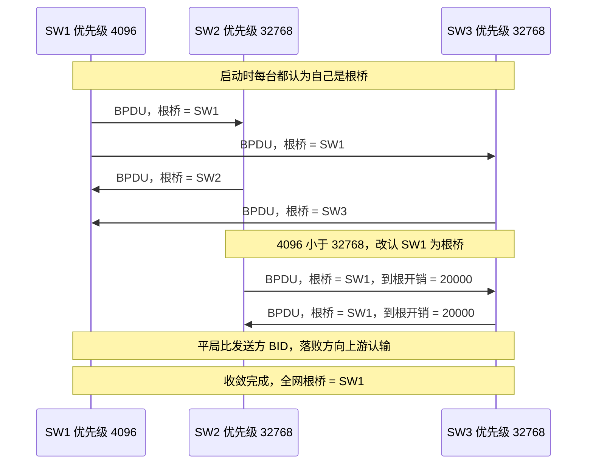
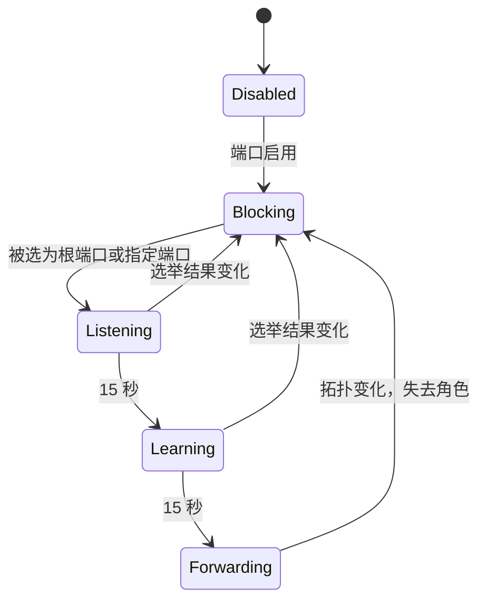
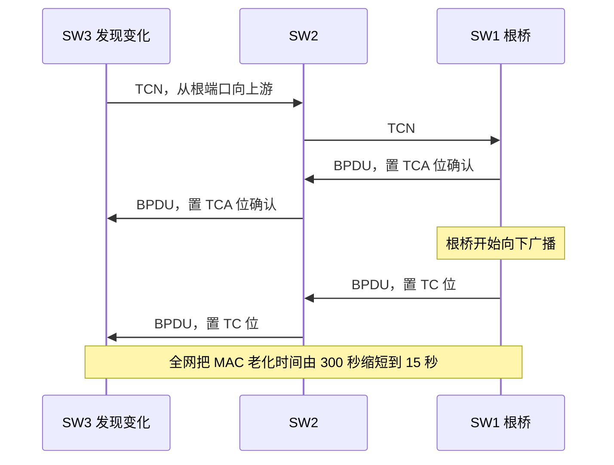
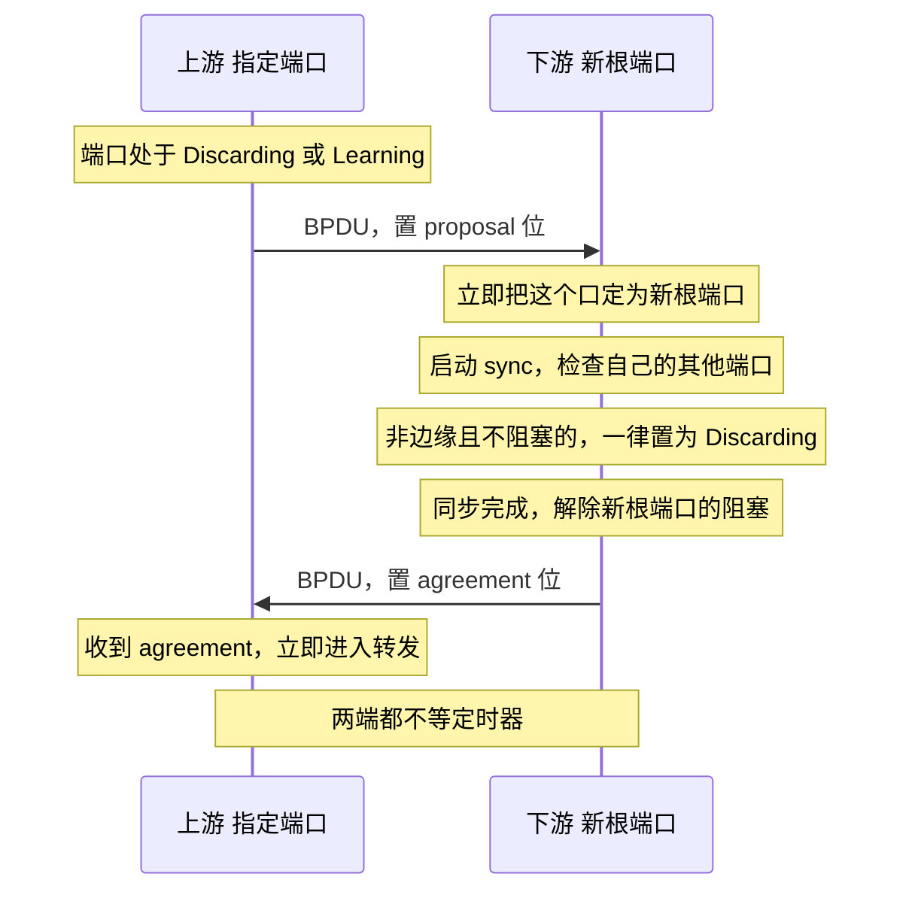

---
tags:
  - 基本功/网络
---

# STP、RSTP 与 MSTP

同一条技术线演进的三代二层防环协议。三代之间的关系是**继承加改造**，不是互相替代的三种方案：

| 协议 | 标准 | 出现时间 | 解决的问题 |
| --- | --- | --- | --- |
| `STP` | 802.1D | 1985 起 | 二层环路 |
| `RSTP` | 802.1w | 2001 | STP 收敛太慢（30~50 秒） |
| `MSTP` | 802.1s | 2002 | 全网一棵树导致冗余链路闲置 |

后来 `802.1D-2004` 把 `802.1w` 合并了进去，所以今天说「跑 802.1D」通常指的就是 RSTP。

`[[12-交换机与路由器：两种转发机制]]` §1.5 讲过 STP 的基础机制，这篇展开三代协议的全部细节。

## 1. 二层为什么需要防环

### 1.1 三类故障

三台交换机两两相连形成三角形，一台机器发出广播帧：

```
T=0   SW1 收到 → 从另外两个口各发一份 → SW2、SW3 各收到一份
T=1   SW2 收到 → 除入端口外泛洪 → 发回 SW1，同时发给 SW3
      SW3 收到 → 除入端口外泛洪 → 发回 SW1，同时发给 SW2
T=2   SW2 又收到（来自 SW3）→ 再泛洪；SW3 同理
```

**T=1 那一行是分水岭**：两台交换机各自收到的那份被互相转发了一遍，于是每绕一圈帧数翻倍。

| 绕圈数 | 环上的帧数 |
| --- | --- |
| 1 | 2 |
| 10 | 1024 |
| 20 | 一百多万 |

以交换机微秒级的转发速度，几秒内就能打满链路带宽与 CPU。这是**广播风暴**。

连带两个后果：

| 故障 | 机制 |
| --- | --- |
| **MAC 表震荡**（MAC flapping） | 同一个源 MAC 从两个端口轮流进来，表项被反复改写，CPU 全花在写表上 |
| **重复帧** | 同一个广播帧在环里绕，接收方收到多份 |

### 1.2 三层为什么没这个问题

三层有 `TTL`——每经一跳减一，减到 0 丢弃。**二层帧里没有任何字段会随转发递减**，所以环里的帧不会自己消失。

这个差异决定了两种截然不同的解法：

| | 三层 | 二层 |
| --- | --- | --- |
| 环路的处理 | **被动兜底**：让包自己耗尽 | **主动预防**：转发前就断环 |
| 手段 | `TTL` | 生成树协议 |
| 代价 | 环路期间包被丢弃 | 冗余链路必须闲置 |

## 2. STP（IEEE 802.1D）

### 2.1 核心思路

所有交换机协商出一个共识——**哪些端口转发，哪些闲着**。闲着的端口保留物理连接但不转发用户数据帧，于是「环」在逻辑上消失。

**「闲着」不等于「断开」**：

| 阻塞端口仍然做 | 阻塞端口不做 |
| --- | --- |
| 收发 `BPDU` | 不转发用户数据帧 |
| 听拓扑变化 | 不学习源 MAC |

心跳还在，所以活跃链路一断，它立刻接手。

### 2.2 BPDU

交换机之间的对话靠 **BPDU**（Bridge Protocol Data Unit），**默认每 2 秒一次**（`hello-time`），发往链路协议专用组播地址 `01:80:C2:00:00:00`——交换机不转发这类帧，只在本机处理。

| 字段 | 作用 |
| --- | --- |
| 协议 ID / 版本 | 标识这是 STP 报文 |
| BPDU 类型 | 配置 BPDU 或 TCN BPDU |
| 标志 | 802.1D 只定义两位：`TC`（拓扑变化）与 `TCA`（TC 确认） |
| 根桥 ID | 发送方**认为**的根桥 |
| 到根桥的路径开销 | 从这里到根桥要花多少 |
| 发送方桥 ID | 我是谁 |
| 发送方端口 ID | 从哪个口发的 |
| 消息寿命 / 最大寿命 | 防止 BPDU 无限转发的计时字段 |

**「发送方认为的根桥」是协议的精髓**：每台交换机启动时都以为自己是根桥（BPDU 里填自己），收到别人的 BPDU 一比较——**发现对方报的根桥更优就改认对方，并把更新后的信息往下游传**。这个过程就是收敛。

根桥持续每 2 秒发一次；非根交换机收到后把自己的开销加上再往下传，所以**从根桥往外，BPDU 里的开销递增**。

### 2.3 选举四步

| 步骤 | 选什么 | 判据 | 数量 |
| --- | --- | --- | --- |
| 1 | **根桥** | `BID` 最小 | 全网一台 |
| 2 | **根端口**（`RP`） | 到根桥路径开销最小 | 每台非根交换机一个 |
| 3 | **指定端口**（`DP`） | 该链路上到根桥开销最小的一端 | 每条链路一个 |
| 4 | 落选的 | —— | 全部阻塞 |

**`BID`（Bridge ID，8 字节）** = 桥优先级（2 字节）+ 交换机 `MAC`（6 字节）。先比优先级，小的赢；相同则比 `MAC`。

优先级默认 **32768**，只能取 **4096 的倍数**（0、4096、8192…）。所以只要把核心交换机配成 4096，它必然当选。

**这一步是「根桥不是核心交换机」这类故障的根源**——默认全为 32768，于是比 `MAC`，谁小谁当，等于随机。

选举过程本身就是一轮 BPDU 的交换与比较：



收敛之后，每台非根交换机再按「到根桥开销最小」选出自己的根端口，每条链路上再按同样判据选出指定端口。

### 2.4 路径开销

开销按带宽折算，交换机把沿途各端口开销**累加**：

| 链路带宽 | 经典 STP（802.1D） | RSTP（802.1w） |
| --- | --- | --- |
| 10 Mbps | 100 | 2000000 |
| 100 Mbps | 19 | 200000 |
| 1 Gbps | 4 | 20000 |
| 10 Gbps | 2 | 2000 |

两套数值的来源不同：经典 STP 用 16 位字段，RSTP 改用 32 位以便表达万兆以上的差异。

「到根桥的开销」= 沿途所有**出端口**开销之和。环里开销大的那条链路，会有一端被判为阻塞。

### 2.5 端口状态与 30 秒的由来

| 状态 | 持续 | 收 BPDU | 学 MAC | 转发数据 |
| --- | --- | --- | --- | --- |
| `Disabled` | —— | 否 | 否 | 否 |
| `Blocking` | —— | 是 | 否 | 否 |
| `Listening` | **15 秒** | 是 | 否 | 否 |
| `Learning` | **15 秒** | 是 | 是 | 否 |
| `Forwarding` | —— | 是 | 是 | 是 |



**从不转发到转发最少等 30 秒**（`Listening` 15 + `Learning` 15），全程通常 **30~50 秒**。

**为什么要等**：拓扑变化时新 BPDU 要一层层传到全网，传播本身需要时间。端口若立刻转发，在「有人还以为旧拓扑有效」的窗口里会形成**临时环路**。这 30 秒是**用一个保守的等待窗口覆盖信息传播的最坏延迟**。

`Learning` 阶段专门用来提前学 MAC——先建立转发表、再转发数据，减少开始转发瞬间的泛洪。

### 2.6 拓扑变化通知

链路断了，下游怎么通知根桥？靠 **TCN BPDU**：

```
1. 发现变化的交换机 → 从根端口向上游发 TCN
2. 上游继续向上转发 → 一直到根桥
3. 根桥 → 回带 TCA 标志的 BPDU 确认
4. 根桥 → 向下游广播带 TC 位的 BPDU
5. 所有交换机把 MAC 表老化时间从 300 秒缩短到 forward delay（15 秒）
```

第 5 步是关键：拓扑变了，原有「MAC → 端口」映射可能已失效，不清理就会继续往旧端口发。缩短老化时间让收敛更快。

传播路径是「先向上报到根桥，再由根桥向下广播」：



**这个「先上后下」的结构正是 RSTP 要改掉的地方**——通知根桥这一段在链路长时延迟明显，RSTP 改由发起者自己泛洪。

### 2.7 四个局限

| 局限 | 后果 |
| --- | --- |
| **依赖定时器** | 收敛慢，最坏 50 秒 |
| **只有一棵树** | 冗余链路全部闲置，花钱买的带宽用不上 |
| **拓扑变化要先通知根桥** | 通知链路长，慢 |
| **链路断开也算拓扑变化** | 触发不必要的全网刷新 |

这四条正好是 RSTP 与 MSTP 各自的改进目标。

## 3. RSTP（IEEE 802.1w）

RSTP 的计算规则**与 STP 完全相同**（桥/端口优先级用法没变），改的是**达到该拓扑的步骤**。

### 3.1 端口角色与状态解耦

这是 RSTP 的设计核心。它把**角色**（这个端口在拓扑里干什么）与**状态**（当前转不转发）拆成两个独立变量：

| 角色 | 含义 |
| --- | --- |
| `Root` | 收到最佳 BPDU 的端口，到根桥最近 |
| `Designated` | 能向所在网段发送最佳 BPDU 的端口 |
| **`Alternate`** | 从**另一个网桥**收到更优 BPDU 而被阻塞，提供通往根桥的替代路径 |
| **`Backup`** | 从**同一个网桥**收到更优 BPDU 而被阻塞，提供同一网段的冗余 |

802.1D 的「阻塞端口」在 RSTP 里被拆成 `Alternate` 与 `Backup` 两个角色。**这个区分不是新发明**——Cisco 的 `UplinkFast` 早就在内部做了同样的区分，RSTP 把它标准化了。

**角色与状态可以不一致**：一个端口可以同时是 `Designated` 且 `Discarding`——这表示它正在向「指定转发」过渡的短暂瞬间。

**状态从 5 个压到 3 个**：

| 802.1D | RSTP | 在活动拓扑中 | 学 MAC |
| --- | --- | --- | --- |
| `Disabled` | `Discarding` | 否 | 否 |
| `Blocking` | `Discarding` | 否 | 否 |
| `Listening` | `Discarding` | 是 | 否 |
| `Learning` | `Learning` | 是 | 是 |
| `Forwarding` | `Forwarding` | 是 | 是 |

### 3.2 提议-同意握手

RSTP 快速收敛的核心机制，**完全不依赖定时器**：

```
1. 指定端口处于 Discarding 或 Learning 时，发出的 BPDU 置 proposal 位
   （只有这两种状态下才置）
2. 对端收到更优信息 → 立即把该端口定为新根端口
   → 启动 sync，检查自己所有端口是否与新信息同步
3. 端口「in-sync」的两个条件（满足其一）：
   · 该端口处于阻塞状态（稳定拓扑中就是 Discarding）
   · 该端口是边缘端口
4. 为让所有端口 in-sync，只需把不满足条件的端口置为 Discarding
5. 同步完成后，解除对新根端口的阻塞，回一个 agreement 消息
   （agreement 是 proposal BPDU 的副本，只是把 proposal 位换成 agreement 位）
6. 收到 agreement → 端口立即转发
```

**与 STP 的根本区别就在「立即」**：802.1D 要等两个 `forward-delay`（2 × 15 = 30 秒），RSTP 靠握手波沿网络快速传播，**几百毫秒**内完成。



**这张图里没有出现任何定时器**——收敛速度由握手在网络中的传播速度决定，与链路跳数成正比，与 `forward-delay` 无关。

**回退机制**：指定端口发出 proposal 后若**没等到 agreement**，会退回传统的 `Listening` → `Learning` 序列。这发生在对端不支持 RSTP，或对端端口处于阻塞状态时。

**Cisco 的一个增强**：sync 时只把**原来的根端口**置为 Discarding，而不是把所有非边缘端口都置一遍。常见重收敛场景因此少做几次阻塞操作。

### 3.3 边缘端口与链路类型

**边缘端口**（对应 Cisco 的 `PortFast`）：直连终端设备的端口不会形成环路，**直接进入转发，跳过 `Listening` 与 `Learning`**。

| 特性 | 行为 |
| --- | --- |
| 链路切换时 | **不产生拓扑变化**（终端设备不会转发 BPDU） |
| 一旦收到 BPDU | **立即失去边缘端口身份**，变回普通生成树端口 |
| 配合 `BPDU Guard` | 收到 BPDU 直接关闭端口（防私接交换机） |

**链路类型决定能否快速收敛**：

| 双工模式 | 链路类型 | 能否快速过渡 |
| --- | --- | --- |
| 全双工 | **点对点** | 能 |
| 半双工 | 共享（`Shared`） | 不能 |

这个推断是**自动的**，可被显式配置覆盖。**半双工端口只能跑传统收敛**，这是排查「为什么这个口收敛慢」时的第一个检查点。

### 3.4 拓扑变化机制的差异

| | 802.1D | RSTP |
| --- | --- | --- |
| 谁发起传播 | **只有根桥** | **发起者自己** |
| 是否要先通知根桥 | 是 | **否** |
| 专门的 TCN 报文 | 有 | **无**（直接用带 `TC` 位的 BPDU） |
| 什么算拓扑变化 | 端口 up/down 都算 | **只有非边缘端口进入转发**才算 |
| 刷新范围 | 全网 | 发起者 + 下游 |

**RSTP 的关键改动**：

1. **一步式进程**：检测到变化的网桥自己把信息泛洪出去，不等根桥。省掉了「通知根桥」这一整段延迟。
2. **连通性丢失不算拓扑变化**——802.1D 里端口转入阻塞会产生 TC，RSTP 不产生。理由是：链路断了本身不需要刷新 MAC 表，只有**新路径可能改变转发方向**时才需要。
3. **`TC While` 计时器**：值为**两倍的 `hello-time`**（默认 4 秒）。在它运行期间，端口发出的 BPDU 都带 `TC` 位，同时刷新关联的 MAC 表项。

结果：**几秒内**（`hello-time` 的少量倍数）整个网络的 MAC 表大部分被刷新。

**代价**：可能造成更多临时泛洪。用短暂的泛洪换取「不留陈旧信息」，这个取舍在快速收敛场景下是划算的。

### 3.5 BPDU 作为保活机制

**处理方式的两点变化**：

| | 802.1D | RSTP |
| --- | --- | --- |
| 发送时机 | 只中继根桥的 BPDU | **每个 `hello-time` 都自己发**，即使没从根桥收到 |
| 信息老化 | 等 `max_age`（20 秒） | **连续丢 3 个 `hello`** 即认为邻居失联 |

RSTP 的 BPDU 承担了**保活**职责——漏掉连续 3 个 BPDU（默认 6 秒）就判定失去连通性，比等 `max_age` 的 20 秒快得多。

**接受较差 BPDU**：网桥从指定/根桥收到较差信息时**立即接受并替换**先前的信息。这是 Cisco `BackboneFast` 的核心机制，RSTP 原生内置。

### 3.6 与旧式网桥的兼容

RSTP 能和老 STP 互操作，但**与旧式网桥交互时会丧失快速收敛优势**。

机制是**迁移延迟计时器**：

| 参数 | 值 |
| --- | --- |
| `Migration Delay` | **3 秒** |
| 模式切换响应时间 | **最多两倍 `hello-time`** |

端口 up 时启动 `Migration Delay`，**在此期间锁定当前模式**。到期后，端口适应它收到的**下一个 BPDU** 所对应的模式。若因 BPDU 导致模式改变，计时器重启，以限制切换频率。

**具体场景**：A、B 跑 RSTP 的链路上接入一台老式 STP 网桥 C。C 忽略 RSTP BPDU（RSTP 用的是 **type 2, version 2**，旧式网桥会直接丢弃），认为网段上没别人，开始发较差的老格式 BPDU。A 收到后最多两倍 `hello-time` 内切换为 802.1D 模式。

**一个已知局限**：C 被移除后，A 在该端口上仍跑 STP 模式（它不知道 C 已经走了），**需要手动干预**重启该端口的协议检测。

### 3.7 三代收敛时间对比

| 场景 | 802.1D | 802.1w |
| --- | --- | --- |
| 端口 up 到转发（边缘端口） | 30 秒 | **立即** |
| 直连链路故障切换 | 30 秒以上 | **几百毫秒** |
| 间接链路故障 | 50 秒 | 几百毫秒 |
| 点对点链路拓扑变化 | 30 秒 | 秒级 |

RSTP 原生的特性对应着 Cisco 三件套：

| Cisco 专有 | RSTP 中的对应 |
| --- | --- |
| `PortFast` | **边缘端口** |
| `UplinkFast` | **`Alternate` 端口**直接顶上，原生内置、自动启用 |
| `BackboneFast` | **接受较差 BPDU** |

## 4. MSTP（IEEE 802.1s）

### 4.1 为什么需要多实例

STP 与 RSTP 全网只有**一棵树**，意味着：

- 所有 VLAN 共用同一条活跃路径；
- 其余冗余链路**全部闲置**。

这在多 VLAN 场景下浪费严重。MSTP 的思路是**按 VLAN 分组，每组一棵独立的树**：

```
实例 1（VLAN 1-10）  → 活跃路径走链路 A
实例 2（VLAN 11-20） → 活跃路径走链路 B
```

两条链路都在用，冗余链路从「闲置」变成**负载分担**。

### 4.2 Region 与三个属性

MSTP 把交换机划分为 **Region**（域）。同一个 Region 内的交换机必须配置**完全一致**的三个属性：

| 属性 | 作用 |
| --- | --- |
| **Region 名** | 标识符 |
| **修订号**（revision） | 版本标识 |
| **VLAN 到实例的映射** | 哪个 VLAN 属于哪个实例 |

**三个属性里任何一个不匹配，端口就被标记为「边界端口」**——两台交换机不属于同一个 Region。

这个设计的意图是：**Region 内部是「自己人」，可以用同一套 VLAN 映射；Region 之间只当成一台大交换机来对待**，不需要知道对方内部的实例细节。

### 4.3 IST / CST / CIST

三个容易混的概念，用「范围」来区分最清楚：

| 概念 | 范围 | 作用 |
| --- | --- | --- |
| **IST**（Internal Spanning Tree） | **Region 内部** | 就是**实例 0**，保留用于与其他 STP 和其他 Region 交互 |
| **CST**（Common Spanning Tree） | **Region 之间** | 把所有 Region 视为一台「大网桥」，它们之间形成的那棵树 |
| **CIST**（Common and Internal ST） | **全网** | CST 与各 Region 内 IST 的合集，是全网唯一的树 |

**层级关系**：

```
CIST（全网唯一的树）
 ├─ CST：Region 与 Region 之间
 └─ IST：每个 Region 内部（= 实例 0）
      └─ MSTI 1~15：Region 内部额外的实例
```

### 4.4 边界端口的行为

**这是 MSTP 最关键的一条约束**：

> 为保证无环，**所有边界端口的转发/阻塞状态必须与 IST 的状态一致**。

含义是：**MSTI（实例 1~15）只在 Region 内部起作用**。跨 Region 的路径由 IST/CST 唯一决定，不受各 Region 内部实例划分的影响。

所以 MSTP 的负载分担**只在 Region 内部有效**。如果两台交换机不在同一个 Region（三个属性有差异），它们的多条链路就只会有一条活跃——等于退化成 RSTP。

### 4.5 实例数与限制

| 项 | 值 |
| --- | --- |
| 实例 0 | **IST**，保留，不可改用途 |
| 实例 1 ~ 15 | **只在 MST Region 内部有效** |
| 默认映射 | 所有 VLAN 默认映射到实例 0 |

**只支持 16 个实例**（0 + 15）——这是 MSTP 的重要约束。VLAN 数量可以几千，但实例只有 16 个。实务上通常按「业务大类」分组，比如「生产 / 办公 / 测试」各一个实例，而不是每个 VLAN 一个。

### 4.6 配置要点

MSTP 的配置有三个容易踩的坑：

| 坑 | 后果 |
| --- | --- |
| 三个属性不一致 | 边界端口产生，Region 被拆分，跨 Region 退化成单路径 |
| 改配置后没提交 | 部分厂商的实现需要显式 commit，未提交的改动不生效 |
| 实例映射改了但没同步改全网 | 不同交换机的映射不一致 → 直接拆出多个 Region |

**排查时先确认 Region 是否统一**——这是 MSTP 类问题的第一步：

```bash
# Cisco
show spanning-tree mst configuration        # 看三个属性
show spanning-tree mst 0                    # 看 IST 状态
show spanning-tree mst <实例号>              # 看具体实例

# Linux bridge（不支持 MSTP，只有单实例 STP）
cat /sys/class/net/br0/bridge/root_id
bridge link show
```

## 5. 三代对比

| 维度 | STP（802.1D） | RSTP（802.1w） | MSTP（802.1s） |
| --- | --- | --- | --- |
| 端口角色 | 3 | 4（加 `Alternate` / `Backup`） | 4（继承 RSTP） |
| 端口状态 | 5 | **3** | 3 |
| 树的数量 | 1 | 1 | **每实例一棵（最多 16）** |
| 收敛时间 | 30~50 秒 | **几百毫秒** | 几百毫秒 |
| 依赖定时器 | 是 | **否**（握手取代） | 否 |
| 拓扑变化传播 | 先通知根桥 | **发起者自己泛洪** | 同 RSTP |
| 冗余链路利用 | 闲置 | 闲置 | **可负载分担** |
| 与之交互 | —— | 兼容 STP，但降速 | 兼容 STP / RSTP，跨 Region 按 IST 处理 |
| 典型场景 | 遗留设备 | 单一 VLAN 或小规模 | 多 VLAN 的园区网、数据中心接入 |

**选择建议**：

- **新建园区网**：直接上 MSTP。RSTP 只能利用一条路径，多 VLAN 场景浪费明显。
- **单一 VLAN 或规模很小**：RSTP 足够，MSTP 的 Region 管理反而是额外负担。
- **有遗留设备**：混合部署会拉低到最慢的那个，优先淘汰老设备。
- **数据中心**：不用 STP 家族作为主力，走 MLAG 或 VXLAN。

## 6. 替代方案

STP 家族的核心代价是「**用闲置换无环**」——为断环必须阻塞链路，阻塞的就是白白闲置的带宽。三条绕开它的路子：

| 方案 | 思路 | 代价 |
| --- | --- | --- |
| **MLAG / vPC** | 把两台物理交换机当成**一台**逻辑设备，从根上不产生环 | 需要特定硬件与配对配置 |
| **TRILL / SPB** | 用类似三层路由的方式做二层转发，天然多路径 | 生态没起来，部署少 |
| **VXLAN + EVPN** | 用 overlay 封装绕过二层，底层走三层等价多路径 | 复杂度高，需要支持 VTEP 的设备 |

数据中心现在基本不以 STP 为主力——要么 MLAG 消环，要么 VXLAN 绕开二层。STP 家族主要留在办公网与接入层这类对收敛不苛刻的场景。

## 7. 排查清单

### 7.1 四个最常见的坑

| 现象 | 成因 | 处置 |
| --- | --- | --- |
| **根桥不是核心交换机** | 默认优先级全为 32768 → 比 MAC → 谁小谁当，等于随机 | 核心交换机显式配 `priority 4096`（或 0） |
| 插了台家用路由器全网卡顿 | 它发 BPDU 参与选举，或不参与导致临时环路 | 接入端口配 **`BPDU Guard`** |
| 收敛慢、中断 30 秒以上 | 还在跑经典 STP，或端口是半双工（`Shared`） | 换 RSTP；检查双工模式 |
| MSTP 只在部分链路负载分担 | Region 不统一，边界端口状态跟随 IST | 核对三个属性 |

### 7.2 命令行

```bash
# Cisco IOS
show spanning-tree                              # 本机端口角色与状态
show spanning-tree root                         # 根桥信息
show spanning-tree interface <端口>              # 单端口详情
show spanning-tree mst configuration            # MSTP 三个属性
show spanning-tree summary                      # 模式与统计

# Linux bridge（只支持单实例 STP/RSTP）
cat /sys/class/net/br0/bridge/root_id           # 根桥 ID
cat /sys/class/net/br0/bridge/root_path_cost    # 到根桥开销
bridge link show                                # 各端口状态
```

### 7.3 看输出时的三个判据

| 看什么 | 判据 |
| --- | --- |
| **根桥 ID** | 是否等于**核心交换机**的 `BID`。不是就有问题 |
| **端口角色分布** | 一个环里应该恰好有一个端口被阻塞。全转发 = 有环；多个阻塞 = 路径设计有问题 |
| **端口类型** | `P2P` 才能快速收敛；`Shared` 说明半双工，会退回慢收敛 |

### 7.4 三个典型误判

| 误判 | 实际情况 |
| --- | --- |
| 「有冗余链路就一定负载分担」 | 只有 MSTP 且 Region 统一才分担；RSTP 下冗余链路 100% 闲置 |
| 「配了 `PortFast` 就安全」 | `PortFast` 只让端口快速转发，**不防环**。必须配 `BPDU Guard` |
| 「`show spanning-tree` 显示 forwarding 就没问题」 | 要连**根桥是谁**一起看。所有端口 forwarding 恰恰是环路的征兆 |

## 相关

- [[12-交换机与路由器：两种转发机制]] —— 交换机与 MAC 表的基础机制，STP 的入门版讲解在其 §1.5
- [[10-以太网与 ARP]] —— 以太网帧格式、`01:80:C2:00:00:00` 这类链路协议地址
- [[01-容器的本质]] —— Linux `bridge` 的生成树行为（默认关闭，容器场景通常不需要）

## 参考

- *IEEE 802.1D — MAC Bridges (incorporates 802.1w Rapid Spanning Tree)*. IEEE. https://standards.ieee.org/ieee/802.1D/998/
- *IEEE 802.1Q — Bridges and Bridged Networks (incorporates 802.1s Multiple Spanning Tree)*. IEEE. https://standards.ieee.org/ieee/802.1Q/6844/
- *Understand Rapid Spanning Tree Protocol (802.1w)*. Cisco Systems. https://www.cisco.com/c/en/us/support/docs/lan-switching/spanning-tree-protocol/24062-146.html
- *Configuring MST (802.1s) / RSTP (802.1w) on Catalyst Series Switches*. Cisco Systems. https://www.cisco.com/c/en/us/support/docs/lan-switching/spanning-tree-protocol/19080-123.html
- *Linux Bridge*. Linux kernel documentation, `Documentation/networking/bridge.rst`. https://www.kernel.org/doc/Documentation/networking/bridge.rst

IEEE 802.1D / 802.1Q 是付费标准，本篇的机制与定时器数值对照 Cisco 官方公开文档；Linux `bridge` 的行为来自内核文档。
